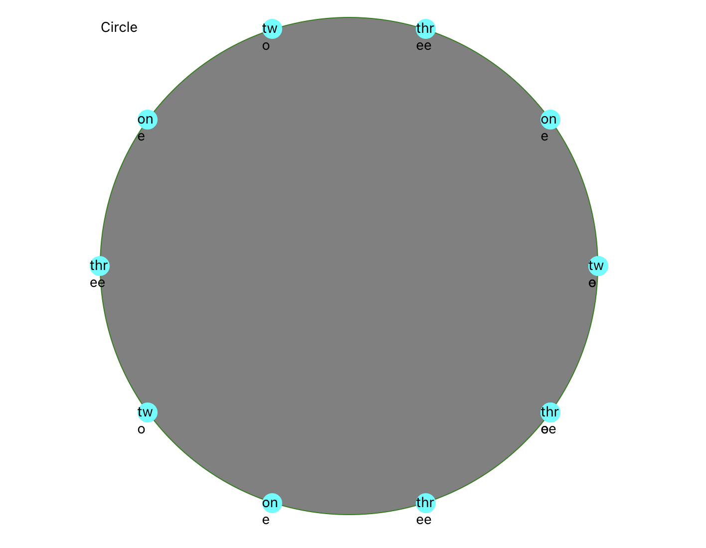

# circlebutton

<!-- language-all: javascript -->

https://github.com/crossplatformsweden/circlebutton

React-native Expo POC for drawing views around a circle

<center><p>

</p></center>

---

[](https://github.com/prettier/prettier) [](https://www.crossplatform.se/)

## Table of Contents

- [Structure](#structure)
- [Scripts](#scripts)
  - [yarn lint](#yarn-lint)
  - [yarn start](#yarn-start)
  - [yarn ios](#yarn-ios)
  - [yarn android](#yarn-android)
  - [yarn web](#yarn-web)
- [Integrations](#integrations)
  - [Expo](#expo)
  - [React-Native-Web](#react-native-web)
- [Components](#components)
- [DevOps](#devops)
  - [Travis](#travis)
  - [Jira](#jira)
- [Distribution](#distribution)
- [Environment](#environment)
  - [Yarn](#yarn)
  - [Visual Studio Code](#visual-studio-code)
- [Upgrade React-Native](#upgrade-react-native)
- [Forking](#forking)
- [Debugging](#debugging)
- [Environment Variables](#environment-variables)
  - [Configuring Packager IP Address](#configuring-packager-ip-address)
- [Troubleshooting](#troubleshooting)
  - [Can not run ShellScript](#can-not-run-shellscript)

<small><i><a href='http://ecotrust-canada.github.io/markdown-toc/'>Table of contents generated with markdown-toc</a></i></small>

# Structure

Describes the app structure and usage of each part. Add additional ReadMe-files in each folder as needed and link them here.

- [mocks](./__mocks__) - place any Jest manual mocks here to auto mock any node module
- [assets](./assets) - place any images and fonts here
- [components](./components) - see **[Components](#Components)** section
- [config](./config) - global config files
- [lib](./lib) - shared business logic such as context, hooks, api
- [navigation](./navigation/ReadMe.md) - [react-navigation](https://reactnavigation.org/) implementation.
- [storybook](./storybook/index.js) - see **[storybook](#storybook)** section

# Scripts

## yarn lint

Lints the project using Prettier.

## yarn start

Start the React-Native packager. You can optionally

- **`yarn clear`** to start and reset cache of the bundler.

## yarn ios

Like `npm start`, but also attempts to open your app in the iOS Simulator if you're on a Mac and have it installed.

Runs the simulator named `iPhone SE (2nd generation)` which we consider most stable.

<!-- There's a couple of scripts that runs a specific device:

- **`yarn ios-device`** - runs default device which can be a physical one (see "Run on device" above)
- **`yarn ios-bundle`**: bundle JS for release
- **`yarn ios-release`**: run on device in Relase mode (requires release cert)
- **`yarn iosx`**: run on iPhone X (11.4)
- **`yarn ios-schemes`**: list available schemes and products -->

## yarn android

Like `npm start`, but also attempts to open your app on a connected Android device or emulator. Requires an installation of Android build tools (see [React Native docs](https://facebook.github.io/react-native/docs/getting-started.html) for detailed setup).

<!--
- **[Android Release Build](#android-release-build)**
- **`yarn android-build`**: bundle relase AAB
- **`yarn android-beta`**: fastlane upload to beta
- **`yarn android-release`**: builds the app in release mode, bundling all JS so it can run on a device without an active bundler. Ensure the app runs in release before PR.
- **`yarn android-signing`**: generate the signing report, so you can retrieve SHA-1 hash etc.
- **`yarn android-reverse`**: runs `adb reverse` so the connected device can find the bundler. -->

## yarn web

Start web version. See [React-Native-Web](#React-Native-Web)

# Integrations

## Expo

The app is built using [Expo](https://docs.expo.io/) for React-Native. It allows working with JavaScript without native code and instant releases Over The Air (OTA). The commands (above) uses Expo to start, run, build and deploy the app.

- [app.json](./app.json) - Expo config
- [expo-shared](./.expo-shared/README.md) - shared Expo config for all developers

## React-Native-Web

The app runs as a website using React-Native web and Expo. From Expo interface you can launch web, or by running the `yarn web` command.

- https://github.com/necolas/react-native-web
- https://docs.expo.io/workflow/web/

See also: [Web Firebase Hosting](#Web-Firebase-Hosting)

# Components

# DevOps

## Travis

<!--The code is CI built and CD deployed using **[Travis config](./travis.yml)**. The setup requires that secrets are set in the travis project.-->

## Jira

The tasks are described in Jira and commits should be tagged with Jira ticket number and circa time spent using smart commits:

https://support.atlassian.com/jira-software-cloud/docs/process-issues-with-smart-commits/

```bash
git commit -m "LG-6546 User can update profile #time 2h #comment Image upload using Firebase Storage #done"
```

# Distribution

Using Expo the app only needs to be built nativly once, but if any assets change a new release of native code will be required. A native release will also contain the latest version of the bundled JavaScript and work offline / over bad connection.

- [Expo Distribution to stores](https://docs.expo.io/distribution/app-stores/)

Update the version in [app.json](./app.json) before release.

- [Upload to Store](https://docs.expo.io/distribution/uploading-apps/)

# Environment

## Yarn

We install and run our scripts with yarn, as an alternative to npm:

**[Download Yarn](https://yarnpkg.com/lang/en/docs/install/)**

## Visual Studio Code

We use Visual Studio Code with relevant plugins.

- **[React-Native Tools](https://marketplace.visualstudio.com/items?itemName=msjsdiag.vscode-react-native)**
- **[Prettier](https://marketplace.visualstudio.com/items?itemName=esbenp.prettier-vscode)**
- **[TypeScript Hero](https://marketplace.visualstudio.com/items?itemName=rbbit.typescript-hero)**
- **[TypeScript importer](https://marketplace.visualstudio.com/items?itemName=pmneo.tsimporter)**
- **[TypeScript toolbox](https://marketplace.visualstudio.com/items?itemName=DSKWRK.vscode-generate-getter-setter)**
- **[Add jsdoc comments](https://marketplace.visualstudio.com/items?itemName=stevencl.addDocComments)**
- **[Expo Tools](https://marketplace.visualstudio.com/items?itemName=byCedric.vscode-expo)**
- **[GitHub](https://marketplace.visualstudio.com/items?itemName=KnisterPeter.vscode-github)**
- **[Styled Components](https://marketplace.visualstudio.com/items?itemName=jpoissonnier.vscode-styled-components)**
- **[ES7 React/Redux/GraphQL/React-Native snippets](https://marketplace.visualstudio.com/items?itemName=dsznajder.es7-react-js-snippets)**

Optional perfomance heavy

- **[Tabnine Autocomplete AI: autocompletion smart code](https://marketplace.visualstudio.com/items?itemName=TabNine.tabnine-vscode)**

**Refactoring optional tools**

- https://dev.to/alexomeyer/5-vs-code-extensions-that-make-refactoring-easy-1ccb

# Upgrade React-Native

For a native project. Expo projects follows Expo version and upgrade guide.

> npx react-native upgrade

https://reactnative.dev/docs/upgrading#react-native-cli
https://react-native-community.github.io/upgrade-helper/

# Forking

To fork this project and change the bundle, update the .env file and use

```bash
npx react-native-rename <newName> -b <bundleIdentifier>
```

https://www.npmjs.com/package/react-native-rename

If failing, manually copy the `build.gradle` global and app, [info.plist](#info-plist) and

# Debugging

Use VS Code's debugging capabilities to maintain a effective development cycle.

**`Launch.json`** configuration is not checked in, but here is the debug `launch.json` for React-Native

https://github.com/microsoft/vscode-react-native#debugging-react-native-applications

Jest Test debugging:

```json
({
  "type": "node",
  "request": "launch",
  "name": "Jest All",
  "program": "${workspaceRoot}/node_modules/jest/bin/jest",
  "args": ["--runInBand"],
  "console": "integratedTerminal",
  "internalConsoleOptions": "neverOpen"
},
{
  "type": "node",
  "request": "launch",
  "name": "Jest Current File",
  "program": "${workspaceRoot}/node_modules/jest/bin/jest",
  "args": ["${file}", "--collectCoverage=false"],
  "console": "integratedTerminal",
  "internalConsoleOptions": "neverOpen"
})
```

# Environment Variables

You can configure some of Create React Native App's behavior using environment variables.

## Configuring Packager IP Address

When starting your project, you'll see something like this for your project URL:

```
    exp://192.168.0.2:19000
```

The "manifest" at that URL tells the Expo app how to retrieve and load your app's JavaScript bundle, so even if you load it in the app via a URL like `exp://localhost:19000`, the Expo client app will still try to retrieve your app at the IP address that the start script provides.

In some cases, this is less than ideal. This might be the case if you need to run your project inside of a virtual machine and you have to access the packager via a different IP address than the one which prints by default. In order to override the IP address or hostname that is detected by Create React Native App, you can specify your own hostname via the `REACT_NATIVE_PACKAGER_HOSTNAME` environment variable:

Mac and Linux:

```
    REACT_NATIVE_PACKAGER_HOSTNAME='my-custom-ip-address-or-hostname' npm start
```

Windows:

```bash
    set REACT_NATIVE_PACKAGER_HOSTNAME='my-custom-ip-address-or-hostname'
    npm start
```

The above example would cause the development server to listen on `exp://my-custom-ip-address-or-hostname:19000`.

# Troubleshooting

## Can not run ShellScript

Adjust the rights on SH-files for your user (in root). Remarks: we use **[bash terminal in VS Code](#bash-on-windows)**

```bash
    yarn read-sh
```

Or manually:

```bash
    sudo find . -name "\*.sh" | xargs chmod u+x

## Firebase Authentication not working

Getting errors similar to

> [auth/internal-error] {"error":{"code":403,"message":"Requests from this iOS client application <empty> are blocked.","errors":[{"message":"Requests from this iOS client application <empty> are blocked.","domain":"global","reason":"forbidden"}],"status":"PERMISSION_DENIED"}}

Reason: the GCP API key is restricted to bundle ID and Phone Auth doesn't always send the bundle ID

Resolution: remove bundle ID restriction for iOS Firebase key

- https://console.cloud.google.com/apis/credentials
- https://stackoverflow.com/questions/52970822/firebase-auth-internal-error-signup-are-blocked-on-web

## Networking

If you're unable to load your app on your phone due to a network timeout or a refused connection, a good first step is to verify that your phone and computer are on the same network and that they can reach each other. Create React Native App needs access to ports 19000 and 19001 so ensure that your network and firewall settings allow access from your device to your computer on both of these ports.

Try opening a web browser on your phone and opening the URL that the packager script prints, replacing `exp://` with `http://`. So, for example, if underneath the QR code in your terminal you see:

```

    exp://192.168.0.1:19000

```

Try opening Safari or Chrome on your phone and loading

```

    http://192.168.0.1:19000

```

and

```

    http://192.168.0.1:19001

```

If this works, but you're still unable to load your app by scanning the QR code, please open an issue on the [Create React Native App repository](https://github.com/react-community/create-react-native-app) with details about these steps and any other error messages you may have received.

If you're not able to load the `http` URL in your phone's web browser, try using the tethering/mobile hotspot feature on your phone (beware of data usage, though), connecting your computer to that WiFi network, and restarting the packager.

## iOS Simulator won't open

If you're on a Mac, there are a few errors that users sometimes see when attempting to `npm run ios`:

- "non-zero exit code: 107"
- "You may need to install Xcode" but it is already installed
- and others

There are a few steps you may want to take to troubleshoot these kinds of errors:

1. Make sure Xcode is installed and open it to accept the license agreement if it prompts you. You can install it from the Mac App Store.
2. Open Xcode's Preferences, the Locations tab, and make sure that the `Command Line Tools` menu option is set to something. Sometimes when the CLI tools are first installed by Homebrew this option is left blank, which can prevent Apple utilities from finding the simulator. Make sure to re-run `npm/yarn run ios` after doing so.
3. If that doesn't work, open the Simulator, and under the app menu select `Reset Contents and Settings...`. After that has finished, quit the Simulator, and re-run `npm/yarn run ios`.
```
